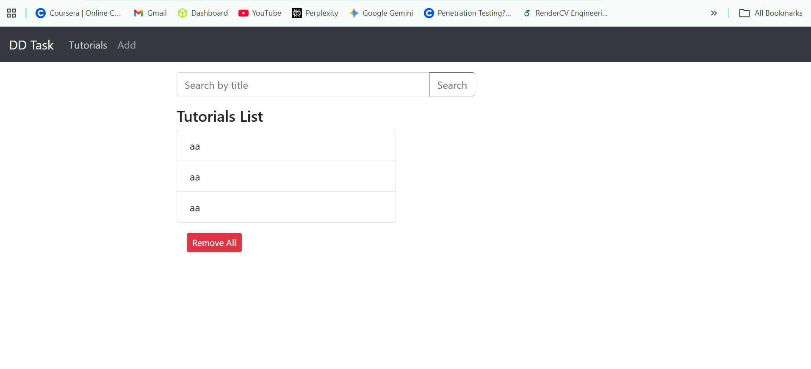
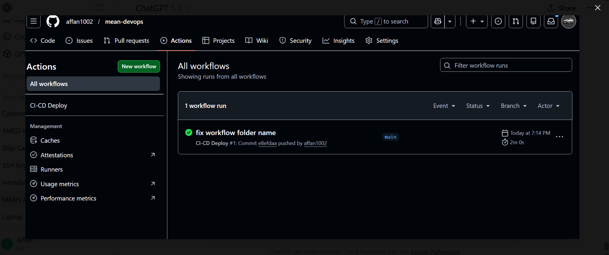

# MEAN Stack DevOps Deployment (Docker + CI/CD + Nginx + AWS)

## 📌 Project Overview

This project demonstrates a complete DevOps pipeline by deploying a containerized **MEAN stack application** on AWS EC2.

The application is automatically built and deployed using **GitHub Actions CI/CD**, runs inside **Docker containers**, and is exposed using **Nginx reverse proxy on port 80**.

---

## 🏗 Architecture

User → Nginx → Angular Frontend → Node Backend → MongoDB
↑
Docker Compose
↑
GitHub Actions CI/CD

---

## ⚙️ Technologies Used

* Angular (Frontend)
* Node.js + Express (Backend)
* MongoDB (Database)
* Docker & Docker Compose
* Nginx Reverse Proxy
* GitHub Actions (CI/CD)
* AWS EC2 (t2.micro)
* Docker Hub (Image Registry)

---

## 📦 Docker Images (DockerHub)


Repository contains:

* affancp/mean-frontend
* affancp/mean-backend

---

## 🚀 CI/CD Pipeline

Whenever code is pushed to `main` branch:

1. GitHub Actions builds Docker images
2. Pushes images to DockerHub
3. Connects to EC2 via SSH
4. Pulls latest images
5. Restarts containers automatically

### GitHub Workflow File

```
.github/workflows/deploy.yml
```

---

## 🔁 GitHub Actions Workflow

The following pipeline is used:

```yaml
name: CI-CD Deploy

on:
  push:
    branches: [ "main" ]

jobs:
  build-and-deploy:
    runs-on: ubuntu-latest

    steps:
    - name: Checkout repo
      uses: actions/checkout@v4

    - name: Login to DockerHub
      uses: docker/login-action@v3
      with:
        username: ${{ secrets.DOCKERHUB_USERNAME }}
        password: ${{ secrets.DOCKERHUB_TOKEN }}

    - name: Build backend
      run: docker build -t affancp/mean-backend:latest ./backend

    - name: Push backend
      run: docker push affancp/mean-backend:latest

    - name: Build frontend
      run: docker build -t affancp/mean-frontend:latest ./frontend

    - name: Push frontend
      run: docker push affancp/mean-frontend:latest

    - name: Deploy to EC2
      uses: appleboy/ssh-action@v1.0.3
      with:
        host: ${{ secrets.EC2_HOST }}
        username: ubuntu
        key: ${{ secrets.EC2_SSH_KEY }}
        script: |
          cd ~/mean-devops
          git pull
          docker compose pull
          docker compose up -d
```

---

## 🖥 Deployment Steps

### 1. Clone Repository

```
git clone https://github.com/affan1002/mean-devops.git
cd mean-devops
```

### 2. Start Application

```
docker compose up -d
```

Application runs at:

```
http://3.87.86.15/
```

---

## 🌐 Nginx Reverse Proxy

Nginx routes traffic:

| Route | Destination      |
| ----- | ---------------- |
| /     | Angular Frontend |
| /api  | Node Backend     |

Application is accessible on **port 80 only** (as required).

---

## 📊 Running Containers

```
docker ps


```

Expected containers:

* mongo
* backend
* frontend
* nginx

---

## 🧪 Application Working UI

(Add screenshots here)

* Home Page

* Add Tutorial

* View Saved Data

---

## 📁 Infrastructure Details

* AWS EC2 Ubuntu Server
* t2.micro instance
* Docker installed
* Nginx configured as reverse proxy

---

## ✅ Result

The application is fully automated:

* Push code → CI/CD triggers
* Images built & pushed
* Server updated automatically
* Website updated without manual intervention

This demonstrates a complete DevOps deployment lifecycle.

